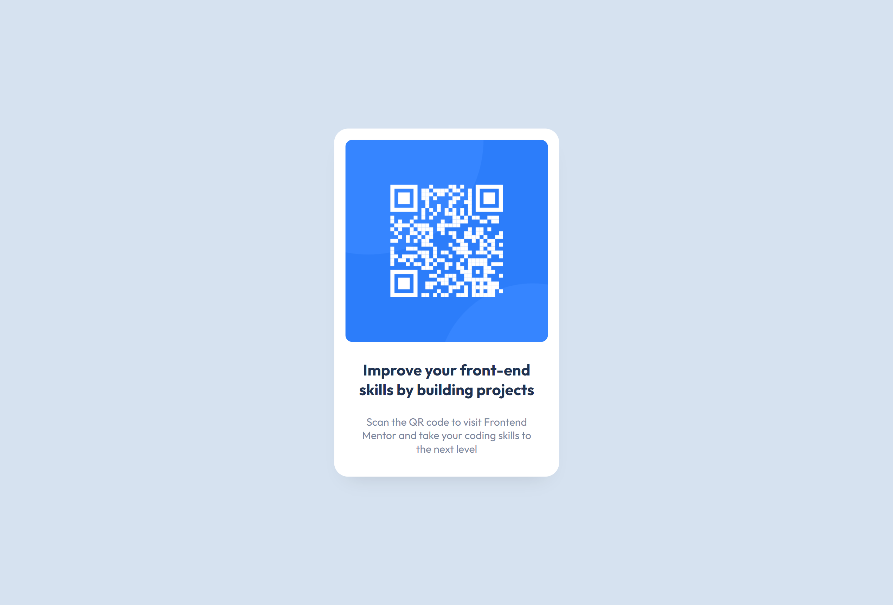

# Frontend Mentor - QR code component solution using NEXT.JS 13

This is a solution to the [QR code component challenge on Frontend Mentor](https://www.frontendmentor.io/challenges/qr-code-component-iux_sIO_H). Frontend Mentor challenges help you improve your coding skills by building realistic projects. 

## Table of contents

- [Overview](#overview)
  - [Screenshot](#screenshot)
  - [Links](#links)
- [My process](#my-process)
  - [Built with](#built-with)
- [Author](#author)

## Overview

### Screenshot

### Links

- Live Site URL : [here](https://qr-code-component-next-js-13.vercel.app/)

## My process

### Built with

- Semantic HTML5 markup
- CSS custom properties
- Flexbox
- Next JS 13

## Author

- Github - [fiqihalfito](https://www.github.com/fiqihalfito)
- instagram - [@fiqihalfito](https://www.instagram.com/fiqihalfito)
- LinkedIn - [@fiqihalfito](https://www.linkedin.com/in/fiqih-alfito/)
